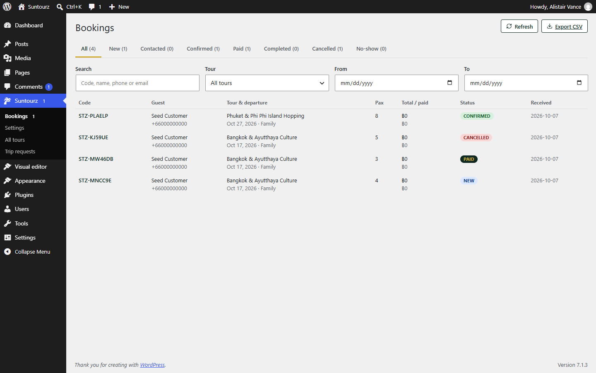

# Suntourz Core

> The engine behind the Suntourz suite: tours, departures, seat-aware bookings, trip requests, reviews, a public REST API and clean admin screens for WordPress.

[](https://github.com/rnd21312/suntourz-core/actions/workflows/ci.yml)
[](LICENSE)




Suntourz Core turns WordPress into a small tour-operator back office. Staff manage tours and bookings from fast React admin screens; the [Suntourz theme](https://github.com/rnd21312/suntourz-theme) (or any headless client) consumes the public REST API.

| Project | Role |
| --- | --- |
| [suntourz-theme](https://github.com/rnd21312/suntourz-theme) | Public website design (requires this plugin) |
| **suntourz-core** (this repo) | Tours, departures, bookings, REST API, admin screens |
| [suntourz-visual-editor](https://github.com/rnd21312/suntourz-visual-editor) | Click-to-edit visual editor, works with any theme (optional) |

## Features

- **Tours** (`stz_tour`) with destinations and travel styles, featured image, gallery, highlights, included / not-included, meeting point and a five-tab **tour editor**: *Details · Itinerary · Pricing · Departures · Flags*.
- **Pricing plans** (Single, Couple, Family, Family+) and optional extras, with per-departure price overrides. Prices are stored in the smallest currency unit.
- **Departures** with capacity and status (`draft`, `open`, `closed`, `cancelled`), plus a *recurring series* generator.
- **Seat-aware bookings** — pending bookings hold seats (configurable), cancelled / no-show release them. Booking codes like `STZ-9OBE1G`.
- **Booking workflow**: `new → contacted → confirmed → paid → completed` (or `cancelled` / `no_show`), status history with notes, amount paid, payment method, one-click Call / WhatsApp / LINE / Email, **CSV export**.
- **Trip requests** — "Plan My Trip" submissions with a follow-up status.
- **Reviews** — guest reviews moderated through WordPress Comments; tour rating updates automatically.
- **Badges** — *on sale*, *last minute*, *only X left*, *special offer*.
- **Public REST API** (`/wp-json/stz/v1`) for tours, quotes, bookings, reviews, articles, destinations and styles.
- **Settings**: company & contact, currency, booking rules, site identity, colours, footer and SEO defaults.
- **Roles**: a dedicated *Booking manager* role; administrators get all capabilities.
- **Safe by default**: nonces for admin, rate-limited public writes, optional Cloudflare Turnstile, no e-mail sent (no leaked data).
- **Demo importer** (admin button and `wp stz demo import|remove`) that creates tours, bookings, pages, menus and articles — and removes only its own content.
- **WP-CLI** support.

## Requirements

- WordPress **6.5+**, PHP **8.1+** (MySQL / MariaDB; SQLite works for development)
- Node.js 20+ only if you build from source

## Install

1. Download `suntourz-core.zip` from the [latest release](https://github.com/rnd21312/suntourz-core/releases/latest).
2. **Plugins → Add New → Upload Plugin** → choose the zip → **Install Now** → **Activate**.
3. Open **Suntourz → Settings → Demo data → Import demo tours** (optional).
4. Install the [Suntourz theme](https://github.com/rnd21312/suntourz-theme) for the public site.

See [docs/installation.md](docs/installation.md).

## Documentation

| Guide | Contents |
| --- | --- |
| [Installation](docs/installation.md) | Install, upgrade, demo data, WP-CLI |
| [User guide](docs/user-guide.md) | Create tours, manage departures, handle bookings and requests |
| [Configuration](docs/configuration.md) | Every setting explained |
| [REST API](docs/rest-api.md) | Public and admin endpoints with examples |
| [Architecture](docs/architecture.md) | Folder map, database schema, services, security |
| [Development](docs/development.md) | Local setup, tests, release process |

## Quick API taste

```bash
curl https://example.com/wp-json/stz/v1/tours
curl -X POST https://example.com/wp-json/stz/v1/quote \
  -H 'Content-Type: application/json' \
  -d '{"departure_id":12,"plan_id":"couple","pax":2}'
```

## Development

```bash
cd frontend
npm ci
npm run dev           # admin apps on :5174
npm run build         # → ../dist
npm run typecheck && npm test
```

PHP unit tests (`tests/Unit`) use PHPUnit — see [docs/development.md](docs/development.md).

## License

Released under the **GNU General Public License v2.0 or later** — see [LICENSE](LICENSE).

## Author

Created and maintained by **theodore-sooske** — Telegram [@theodore-sooske](https://t.me/theodore-sooske).
